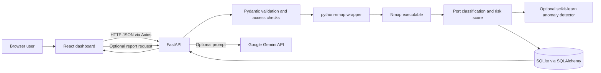

# Phantom Network Scanner: Technical Documentation

## 1. Project Overview

Phantom Network Scanner is a browser-based dashboard backed by a Python API. A user submits an IPv4 address and a scan mode; the backend runs Nmap against the requested host, classifies returned TCP ports, calculates a rule-based risk score, optionally checks the result for anomalies, and stores the scan in SQLite. The dashboard provides scan history, CSV export, database controls, and optional Gemini-generated reports.

The tool is intended for systems and networks that the operator owns or is authorized to assess. It scans only the selected target and the configured Nmap port range; it is not a vulnerability exploit framework or a full network inventory system.

## 2. Architecture



The frontend and API are separate applications. Vercel can host the Vite frontend, but it does not run the long-lived Python/Nmap backend. A deployed frontend therefore needs a reachable backend URL in `VITE_API_URL`.

## 3. Technology Stack

| Area | Technology | Purpose |
| --- | --- | --- |
| Frontend | React 19 | Interactive scanner, history, reports, and settings views |
| Frontend tooling | Vite 8 | Development server and production asset build |
| Styling | CSS and Tailwind CSS 4 tooling | Custom dashboard styles are primarily in `client/src/index.css` |
| HTTP client | Axios | Sends API requests and handles JSON, CSV, and error responses |
| Backend API | FastAPI and Uvicorn | Defines and serves HTTP endpoints |
| Input validation | Pydantic 2 | Validates scan request fields and IPv4/IPv6 address syntax |
| Scanner integration | `python-nmap` and Nmap | Calls the installed Nmap executable and reads its port/service results |
| Persistence | SQLAlchemy and SQLite | Stores scans and their port rows in a local relational database |
| Risk/anomaly analysis | Python rules and scikit-learn One-Class SVM | Calculates risk and optionally flags unusual scan patterns |
| AI reports | `google-generativeai` | Optionally generates a text report from a scan's open ports |
| Configuration | `python-dotenv` and environment variables | Loads local and hosted service configuration |
| Frontend hosting | Vercel | Builds and serves the static React application |
| Backend hosting option | Docker and Render configuration | Packages Python, dependencies, and Nmap for a persistent API service |

## 4. Repository Layout

- `client/src/App.jsx`: Main dashboard state, API calls, scan progress, and tab composition.
- `client/src/components/ScanForm.jsx`: Target IP and scan-mode form.
- `client/src/components/PortTable.jsx`: Displays port state, service, version, and risk.
- `client/src/components/ScanHistory.jsx`: Renders saved scan summaries.
- `client/src/components/AIReport.jsx`: Requests and downloads a Gemini report.
- `client/src/components/Settings.jsx`: Saves an optional Gemini key in browser local storage, exports CSV, and clears history.
- `client/src/index.css`: Dashboard design system and responsive layout.
- `client/vercel.json`: Vercel configuration when the Vercel project Root Directory is `client`.
- `server/main.py`: FastAPI application, input checks, scan orchestration, risk logic, ML, reports, and API routes.
- `server/models.py`: SQLAlchemy `Scan` and `Port` table definitions.
- `server/database.py`: SQLite engine and SQLAlchemy session factory.
- `server/requirements.txt`: Python packages required by the API.
- `server/Dockerfile`: Installs Nmap and Python dependencies for a container deployment.
- `server/seed_data.py`: Optional script that inserts synthetic training history into an empty database.
- `server/scanner.py`: Small standalone Nmap example; the dashboard uses the scan implementation in `server/main.py`.
- `render.yaml`: Render Blueprint for the Docker-based backend.
- `vercel.json`: Vercel configuration when the repository root is selected as the Vercel Root Directory.

## 5. Scan Request Lifecycle

1. The user enters an IP address and chooses TCP Connect (`-sT`), SYN (`-sS`), or Service Detection (`-sV`).
2. The React app sends `POST /scan` with JSON shaped like `{"target_ip":"192.0.2.10","scan_type":"-sT"}`.
3. FastAPI validates the address and scan-mode literal through `ScanRequest`. Non-IP values are rejected before Nmap runs.
4. The backend checks the per-client rate limit and uses a process-local lock so two scans do not run concurrently in the same API process.
5. `python-nmap` invokes the system Nmap executable. By default the command scans the top 20 common TCP ports, disables host discovery with `-Pn`, uses `-T4`, allows one retry, and applies a 15-second host timeout. `-sV` also adds `--version-light`.
6. The backend collects each returned port's number, state, service, product, and version. If Nmap returns no port rows, the API returns a summary row.
7. A rule-based risk score and risk level are calculated. The scan and port rows are committed to SQLite.
8. If the optional ML engine is available and enough history exists, the backend evaluates the scan for an anomaly.
9. The API returns the scan summary and ports; the dashboard updates its result panel and recent-history list.

The rate limit is in memory and allows up to 10 scan requests per client IP in a rolling 60-second window. It resets when the backend process restarts and is not shared across multiple workers.

### Scan Modes

- `-sT`: TCP Connect scan; the recommended mode for a straightforward local Windows demo.
- `-sS`: TCP SYN scan; may require elevated privileges and appropriate packet-capture support, such as Npcap on Windows.
- `-sV`: Performs service/version detection in addition to the selected port scan; it can take longer than a basic connect scan.

The port selection can be changed with the backend variable `SCAN_PORT_SPEC`, for example `--top-ports 100`.

## 6. Risk Scoring

Only ports whose state is `open` add points:

- Each open port adds 10 points.
- Ports in the configured dangerous-port list add another 20 points.
- Port 3389 adds another 30 points and is labeled `Critical` at the port level.
- The overall score is capped at 100.

The overall risk level is `High` at 50 or more, `Medium` from 40 through 49, and `Low` below 40. The per-port label and overall scan level are separate fields, so a `Critical` port does not create a separate overall risk-level value.

The configured high-risk port list is 21, 22, 23, 445, 3306, 3389, 5900, and 8080. Risk labels are heuristic indicators, not proof that a host is vulnerable.

## 7. Optional Anomaly Detection

The ML module uses scikit-learn's `OneClassSVM` with an RBF kernel. It trains on historical risk-score/port-count features and compares the current scan to that baseline. At least 10 historical scans are required. If NumPy or scikit-learn cannot load, there is insufficient history, or model processing fails, scanning continues and the API reports that anomaly analysis was skipped or unavailable.

`server/seed_data.py` can create synthetic scan history for a demonstration. It only seeds an empty database; it does not run automatically. Seeded data is simulated and must not be represented as real network scan evidence.

## 8. Optional Gemini Reports

The Reports tab lets an operator choose a saved scan. The API sends the target, overall risk, and open-port/service summary to the configured Gemini model and asks for a concise threat analysis and mitigation strategy. The report can be downloaded as a text file.

Gemini is not required to run scans. A key can be provided through the Settings screen, where it is kept in that browser's `localStorage`, or through the backend's optional `GEMINI_API_KEY`. `GEMINI_MODEL` selects the preferred model. Do not commit or publish API keys.

## 9. Database Model

The default database is SQLite at `sqlite:///./phantom.db`, relative to the backend process working directory. Running the API from `server/` normally creates `server/phantom.db`.

- `scans`: target IP, timestamp, risk score, and risk level.
- `ports`: scan foreign key, port number, state, service, product, version, and port risk.
- One scan has a SQLAlchemy relationship to its associated port rows.

The Settings page can export saved scan summaries as CSV or delete all port rows and scan rows. The CSV contains scan-level columns, not the complete detailed port list. Container deployments need persistent storage if the SQLite file must survive container replacement.

## 10. API Reference

| Method and path | Purpose |
| --- | --- |
| `GET /` | API health response |
| `GET /history` | Returns saved scans, newest first |
| `POST /scan` | Runs and stores a scan |
| `GET /generate-report/{scan_id}` | Generates a Gemini report for a saved scan |
| `GET /export-csv` | Streams scan history as CSV |
| `DELETE /clear-history` | Deletes stored ports and scans |

When `APP_API_TOKEN` is configured, protected API requests require the matching `X-API-Token` header. The frontend reads its value from `VITE_API_TOKEN`. Because frontend `VITE_*` values are compiled into browser JavaScript, this is not a private secret against users of a public site; use an authenticated server-side proxy for a public production service.

## 11. Local Setup

### Prerequisites

- Python 3.10 or newer.
- Node.js 20.19+ or 22.12+ for Vite 8.
- Nmap installed and available on `PATH`.
- Npcap on Windows for packet-level scan modes; `-sT` is the simplest local demo mode.

### Start the backend

From the repository root in PowerShell:

```powershell
cd server
python -m venv .venv
.\.venv\Scripts\Activate.ps1
pip install -r requirements.txt
Copy-Item .env.example .env
```

For a local-only run, set `APP_ENV=development` in `server/.env`. Start the API:

```powershell
python main.py
```

The API listens on `http://127.0.0.1:8000` by default. A Gemini key and API token are not needed for local scanning when `APP_API_TOKEN` is unset.

### Start the frontend

In a second terminal, from the repository root:

```powershell
cd client
npm install
npm run dev
```

Open the Vite URL shown in the terminal, normally `http://localhost:5173`. Set `VITE_API_URL=http://localhost:8000` in `client/.env.local` if a local override is needed. Local Vite origins on ports 5173 are permitted by the backend only outside production mode.

## 12. Configuration Reference

### Backend

- `APP_ENV`: `development` locally; `production` enables production startup checks and omits development CORS origins.
- `API_PORT`: Port used by `python main.py`; defaults to 8000.
- `FRONTEND_URL`: Exact frontend origin allowed by production CORS.
- `ALLOWED_HOSTS`: Host header allowlist for FastAPI's trusted-host middleware.
- `APP_API_TOKEN`: Optional API access token. Required when `APP_ENV=production`.
- `SCAN_PORT_SPEC`: Nmap port-selection arguments; defaults to `--top-ports 20`.
- `GEMINI_API_KEY`: Optional server-side Gemini key.
- `GEMINI_MODEL`: Preferred Gemini model.

### Frontend

- `VITE_API_URL`: Base URL of the API. Defaults to `http://localhost:8000` for local development.
- `VITE_API_TOKEN`: Optional matching API token, embedded in the built frontend bundle.

## 13. Deployment Notes

- Vercel serves the static frontend only. The Vercel project Root Directory should match its configuration: use `client/` with `client/vercel.json`, or the repository root with the root `vercel.json`.
- The frontend production build is `npm run build` from `client/`, with output in `client/dist` (or `dist` when `client/` is the Vercel root).
- The backend needs a host that supports Python, Docker, and the Nmap executable. `server/Dockerfile` installs Nmap; `render.yaml` describes a Render service.
- For a hosted frontend, configure `VITE_API_URL` to the public backend URL, configure the backend's `FRONTEND_URL` to the exact frontend origin, and align `VITE_API_TOKEN` with `APP_API_TOKEN` if token protection is enabled.
- A backend bound to `127.0.0.1` is local to the developer's computer and is not reachable from a separately hosted Vercel frontend.
- Vercel build failures should be diagnosed from the failed deployment's Build Logs. A green local Vite build proves frontend source compilation, but cannot verify remote project settings, environment variables, or Git integration.

## 14. Security and Operational Limits

- Scan only targets for which you have explicit authorization.
- Do not publish `.env`, `.env.local`, API keys, tokens, or `phantom.db`.
- Do not expose an unauthenticated scan endpoint as a permanent public service.
- Use a specific `ALLOWED_HOSTS` list and exact production `FRONTEND_URL`; do not use wildcard settings for a permanent public service.
- The scan lock and rate limiter are process-local. Multiple API workers do not share them.
- The default Nmap host timeout is 15 seconds, so slow targets or ports beyond the configured range may not appear.
- Risk scores are simple heuristics; they do not replace vulnerability scanning or security review.
- Gemini reports are generated interpretations of scan metadata, not verified vulnerability findings.

## 15. Common Troubleshooting

- **Browser reports a CORS error:** Confirm the local backend runs with `APP_ENV=development`, or set production `FRONTEND_URL` to the exact frontend origin (scheme, host, and port included).
- **Nmap not found:** Install Nmap, confirm `nmap --version` works in the backend terminal, and restart the API process.
- **Windows SYN scan fails:** Try `-sT`, install/update Npcap, and check whether the selected scan mode requires elevated privileges.
- **Scan says another scan is running:** Wait for the active scan to finish; only one scan can run at a time per backend process.
- **AI report fails:** Configure a valid Gemini key and model. Scanning and history do not depend on Gemini.
- **Hosted frontend cannot reach API:** Set the frontend's `VITE_API_URL` to a reachable public backend. `localhost` from a hosted page refers to the viewer's own computer, not the API host.
- **Vercel deployment failed:** Confirm the Vercel Root Directory matches the chosen `vercel.json`, then inspect Build Logs and verify required Vercel environment variables.

## 16. Validation Performed

The frontend production build (`npm run build`) and lint (`npm run lint`) pass in the current workspace. A local browser-to-API scan of `127.0.0.1` completed successfully. These local checks do not confirm the status of a remote Vercel deployment.